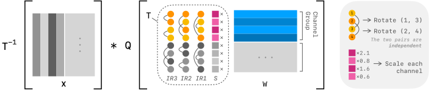

# ParoQuant: Pairwise Rotation Quantization for Efficient Reasoning LLM Inference

[Paper](https://arxiv.org/abs/2511.10645) |
[Blog](https://paroquant.z-lab.ai) |
[Models](https://huggingface.co/collections/z-lab/paroquant)

ParoQuant is an efficient 4-bit weight-only quantization method that achieves state-of-the-art quantization accuracy while incurring minimal overhead during inference. It currently supports LLaMA and Qwen3 model family.



## Quick Start

Try out ParoQuant models with a single command:

```
docker run --rm -it --gpus all --ipc=host paroquant:chat --model z-lab/Qwen3-8B-PARO
```

## Setup

We recommend using the docker image `ghcr.io/z-lab/paroquant:default` without manually setting up environment:

```
docker run -it --gpus all --ipc=host ghcr.io/z-lab/paroquant:default
```

Please follow the setup instructions below if you'd prefer running on the host.

Clone this repository:

```bash
git clone https://github.com/z-lab/paroquant
cd paroquant
```

Install dependencies:

```bash
# use conda (recommended)
conda env create -f environment.yml
conda activate paroquant
pip install ./kernels --no-build-isolation

# or use pip
pip install -r requirements.txt
pip install ./kernels --no-build-isolation
```

You may need to modify [`requirements.txt`](requirements.txt) to match your CUDA version.

## Usage

### Optimization

First, run the optimization script to obtain the optimized checkpoints. The checkpoints will be stored in `output/<model_name>`.

```bash
experiments/optimize/4bit.sh Qwen/Qwen3-8B
```

Then, create a huggingface model with pseudo quantization (*i.e.,* model weights are in FP16 simulating the quantization) or real quantization (*i.e.*, model weights are in INT4):

```bash
# pseudo quantization
python3 scripts/pseudo_quant.py \
    --model Qwen/Qwen3-8B \
    --result-dir output/Qwen3-8B \
    --output-path models/Qwen3-8B-PARO-pseudo

# real quantization
python3 scripts/real_quant.py \
    --model Qwen/Qwen3-8B \
    --result-dir output/Qwen3-8B \
    --output-path models/Qwen3-8B-PARO
```

### Inference

The docker image for interactive inference is `ghcr.io/z-lab/paroquant:chat`. Install `vllm` if you are running on the host:

```bash
pip install vllm==0.15.1
```

To run a real-quantized model with vLLM and open an interactive chat:

```bash
# with docker
docker run --rm -it --gpus all --ipc=host ghcr.io/z-lab/paroquant:chat --model z-lab/Qwen3-8B-PARO

# without docker
python3 scripts/interactive_gen.py --model z-lab/Qwen3-8B-PARO
```

Add `--backend transformers` to run with the Transformers backend instead. Please note that Transformers suffers from performance degradation with long generations.

## Models

We provide pre-quantized 4-bit ParoQuant models listed below. These are real-quantized models and can be loaded with the method described above.

| Model                        | Hugging Face Path                                                                                           |
| ---------------------------- | ----------------------------------------------------------------------------------------------------------- |
| Meta-Llama-3-8B              | [`z-lab/Meta-Llama-3-8B-PARO`](https://huggingface.co/z-lab/Meta-Llama-3-8B-PARO)                           |
| Meta-Llama-3-70B             | [`z-lab/Meta-Llama-3-70B-PARO`](https://huggingface.co/z-lab/Meta-Llama-3-70B-PARO)                         |
| Llama-3.1-8B-Instruct        | [`z-lab/Llama-3.1-8B-Instruct-PARO`](https://huggingface.co/z-lab/Llama-3.1-8B-Instruct-PARO)               |
| Llama-2-7b-hf                | [`z-lab/Llama-2-7b-hf-PARO`](https://huggingface.co/z-lab/Llama-2-7b-hf-PARO)                               |
| Qwen3-0.6B                   | [`z-lab/Qwen3-0.6B-PARO`](https://huggingface.co/z-lab/Qwen3-0.6B-PARO)                                     |
| Qwen3-1.7B                   | [`z-lab/Qwen3-1.7B-PARO`](https://huggingface.co/z-lab/Qwen3-1.7B-PARO)                                     |
| Qwen3-4B                     | [`z-lab/Qwen3-4B-PARO`](https://huggingface.co/z-lab/Qwen3-4B-PARO)                                         |
| Qwen3-8B                     | [`z-lab/Qwen3-8B-PARO`](https://huggingface.co/z-lab/Qwen3-8B-PARO)                                         |
| Qwen3-14B                    | [`z-lab/Qwen3-14B-PARO`](https://huggingface.co/z-lab/Qwen3-14B-PARO)                                       |
| Qwen3-0.6B-Base              | [`z-lab/Qwen3-0.6B-Base-PARO`](https://huggingface.co/z-lab/Qwen3-0.6B-Base-PARO)                           |
| Qwen3-1.7B-Base              | [`z-lab/Qwen3-1.7B-Base-PARO`](https://huggingface.co/z-lab/Qwen3-1.7B-Base-PARO)                           |
| Qwen3-4B-Base                | [`z-lab/Qwen3-4B-Base-PARO`](https://huggingface.co/z-lab/Qwen3-4B-Base-PARO)                               |
| Qwen3-8B-Base                | [`z-lab/Qwen3-8B-Base-PARO`](https://huggingface.co/z-lab/Qwen3-8B-Base-PARO)                               |
| Qwen3-14B-Base               | [`z-lab/Qwen3-14B-Base-PARO`](https://huggingface.co/z-lab/Qwen3-14B-Base-PARO)                             |
| Qwen3-4B-Thinking-2507       | [`z-lab/Qwen3-4B-Thinking-2507-PARO`](https://huggingface.co/z-lab/Qwen3-4B-Thinking-2507-PARO)             |
| DeepSeek-R1-Distill-Llama-8B | [`z-lab/DeepSeek-R1-Distill-Llama-8B-PARO`](https://huggingface.co/z-lab/DeepSeek-R1-Distill-Llama-8B-PARO) |

In addition, we provide the original checkpoints and pseudo-quantized models in [`z-lab/paroquant-checkpoints`](https://huggingface.co/z-lab/paroquant-checkpoints) to facilitate reproduction and further research.

## Reproduction

In the [`experiments`](./experiments/) directory, we provide the original scripts that produce the models, experiment results, and figures in the paper. Please refer to the [README](./experiments/README.md) for more details.

## Docker

We provide three docker images for easy environment setup:

- `ghcr.io/z-lab/paroquant:default` for optimization and non-reasoning task evaluation
- `ghcr.io/z-lab/paroquant:chat` for running the chat app
- `ghcr.io/z-lab/paroquant:eval-reasoning` for reasoning task evaluation

Use the following command to create a container and activate an interactive shell:

```
docker run -it --gpus all --ipc=host ghcr.io/z-lab/paroquant:<tag>
```

## Contribution

Contributions are welcome! Please install `pre-commit` to ensure consistent code styles:

```bash
pip install pre-commit
pre-commit install
```

## Reference

If you find ParoQuant useful or relevant to your research, please kindly cite our paper:

```
@inproceedings{liang2026paroquant,
  title     = {{ParoQuant: Pairwise Rotation Quantization for Efficient Reasoning LLM Inference}},
  author    = {Liang, Yesheng and Chen, Haisheng and Zhang, Zihan and Han, Song and Liu, Zhijian},
  booktitle = {International Conference on Learning Representations (ICLR)},
  year      = {2026}
}
```
