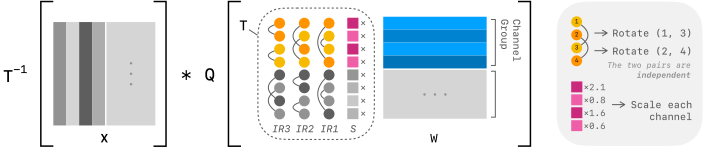

# ParoQuant

[Paper](https://arxiv.org/abs/2511.10645) |
[Blog](https://paroquant.z-lab.ai) |
[Models](https://huggingface.co/collections/z-lab/paroquant)

4-bit weight-only quantization with pairwise rotation for efficient LLM inference. Supports Llama, Qwen3, and DeepSeek on NVIDIA GPUs and Apple Silicon.



## Quick Start

**NVIDIA GPU:**

```bash
docker run --pull=always --rm -it --gpus all --ipc=host \
  ghcr.io/z-lab/paroquant:chat --model z-lab/Qwen3-8B-PARO
```

**Apple Silicon:**

```bash
pip install paroquant[mlx]
python -m paroquant.cli.chat --model z-lab/Qwen3-8B-PARO
```

The backend is auto-detected (MLX on Apple Silicon, vLLM on NVIDIA GPU). Override with `--backend vllm|transformers|mlx`.

## Models

All models are available on [Hugging Face](https://huggingface.co/collections/z-lab/paroquant). Replace the model name in the commands above to try any of them.

**Qwen3**

| Model | HF Path |
|---|---|
| Qwen3-0.6B | [`z-lab/Qwen3-0.6B-PARO`](https://huggingface.co/z-lab/Qwen3-0.6B-PARO) |
| Qwen3-1.7B | [`z-lab/Qwen3-1.7B-PARO`](https://huggingface.co/z-lab/Qwen3-1.7B-PARO) |
| Qwen3-4B | [`z-lab/Qwen3-4B-PARO`](https://huggingface.co/z-lab/Qwen3-4B-PARO) |
| Qwen3-8B | [`z-lab/Qwen3-8B-PARO`](https://huggingface.co/z-lab/Qwen3-8B-PARO) |
| Qwen3-14B | [`z-lab/Qwen3-14B-PARO`](https://huggingface.co/z-lab/Qwen3-14B-PARO) |
| Qwen3-4B-Thinking-2507 | [`z-lab/Qwen3-4B-Thinking-2507-PARO`](https://huggingface.co/z-lab/Qwen3-4B-Thinking-2507-PARO) |

Base (non-instruct) variants: `z-lab/Qwen3-{0.6B,1.7B,4B,8B,14B}-Base-PARO`

**Llama**

| Model | HF Path |
|---|---|
| Llama-2-7B | [`z-lab/Llama-2-7b-hf-PARO`](https://huggingface.co/z-lab/Llama-2-7b-hf-PARO) |
| Llama-3-8B | [`z-lab/Meta-Llama-3-8B-PARO`](https://huggingface.co/z-lab/Meta-Llama-3-8B-PARO) |
| Llama-3-70B | [`z-lab/Meta-Llama-3-70B-PARO`](https://huggingface.co/z-lab/Meta-Llama-3-70B-PARO) |
| Llama-3.1-8B-Instruct | [`z-lab/Llama-3.1-8B-Instruct-PARO`](https://huggingface.co/z-lab/Llama-3.1-8B-Instruct-PARO) |

**DeepSeek**

| Model | HF Path |
|---|---|
| DeepSeek-R1-Distill-Llama-8B | [`z-lab/DeepSeek-R1-Distill-Llama-8B-PARO`](https://huggingface.co/z-lab/DeepSeek-R1-Distill-Llama-8B-PARO) |

Optimization checkpoints and pseudo-quantized models: [`z-lab/paroquant-checkpoints`](https://huggingface.co/z-lab/paroquant-checkpoints).

Want a model that's not listed? [Open an issue](https://github.com/z-lab/paroquant/issues/new) and we'll look into it.

## Installation

```bash
git clone https://github.com/z-lab/paroquant && cd paroquant

pip install -e ".[transformers]" --no-build-isolation  # Transformers backend (GPU)
pip install -e ".[vllm]" --no-build-isolation           # vLLM backend (GPU)
pip install -e ".[mlx]"                                 # MLX backend (Apple Silicon)
pip install -e ".[optim,eval]" --no-build-isolation     # Optimization & evaluation (GPU)
```

Or use Docker: `docker run -it --gpus all --ipc=host ghcr.io/z-lab/paroquant:latest`

## Optimization

```bash
# 1. Optimize
experiments/optimize/4bit.sh Qwen/Qwen3-8B

# 2. Convert to HF checkpoint (--mode real for INT4, --mode pseudo for FP16)
python -m paroquant.cli.convert \
  --model Qwen/Qwen3-8B \
  --result-dir output/Qwen3-8B \
  --output-path models/Qwen3-8B-PARO
```

## Reproduction

See [`experiments/README.md`](./experiments/README.md) for scripts to reproduce all results in the paper.

## Docker Images

| Image | Purpose |
|---|---|
| `ghcr.io/z-lab/paroquant:latest` | Optimization & evaluation |
| `ghcr.io/z-lab/paroquant:chat` | Interactive chat |
| `ghcr.io/z-lab/paroquant:chat-cu130` | Interactive chat (CUDA 13.0 / ARM64) |
| `ghcr.io/z-lab/paroquant:eval-reasoning` | Reasoning task evaluation |

## Citation

```bibtex
@inproceedings{liang2026paroquant,
  title     = {{ParoQuant: Pairwise Rotation Quantization for Efficient Reasoning LLM Inference}},
  author    = {Liang, Yesheng and Chen, Haisheng and Zhang, Zihan and Han, Song and Liu, Zhijian},
  booktitle = {International Conference on Learning Representations (ICLR)},
  year      = {2026}
}
```
